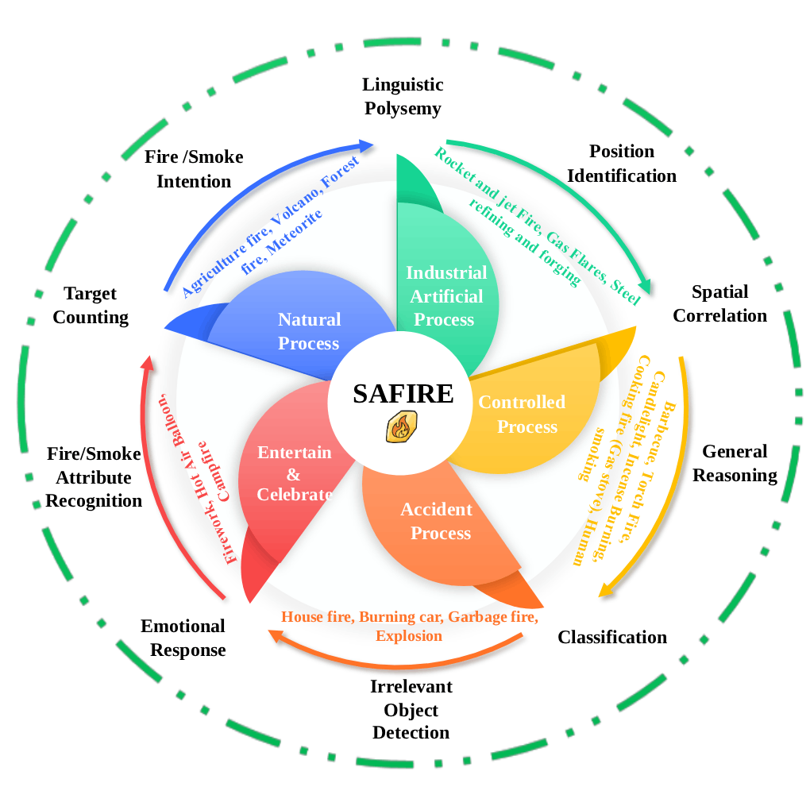

#  SAFIRE: A Safety-Critical Benchmark for Fire and Smoke Scene Reasoning in Multimodal LLMs

**Official repository for the SAFIRE paper (Under Review).**

Authors: Pengfei Li, Naufal Suryanto, Sicheng Zhang, Mohammad Alsharid, Muzammal Naseer.

---

## 📋 Table of Contents

- [News](#-news)
- [Overview](#-overview)
- [Dataset Statistics](#-dataset-statistics)
- [Getting Started](#-getting-started)
- [Dataset and Benchmarks](#-dataset-and-benchmarks)
- [Evaluation](#-evaluation)
- [Citation](#-citation)

---

## 📢 News

- [12 Dec 2025] Refactored code for SAFIRE MLLM evaluation.
- [27 Oct 2025] SAFIRE: A Safety-Critical Benchmark for Fire and Smoke Scene Reasoning in Multimodal LLMs is submitted to ACL ARR 2025 October Submission.

## 🔥 Overview

**SAFIRE** (**S**afety-**A**ware **Fi**re-smoke **R**easoning **E**valuation) is the first large-scale benchmark designed to evaluate Multimodal Large Language Models (MLLMs) in safety-critical fire and smoke scenarios.

### 💡 Why Context Matters
> **Current benchmarks often fail to distinguish between critical fires (e.g., house fires) and benign ones (e.g., campfires), or mistake water vapor for smoke. SAFIRE is designed to test these specific context-aware reasoning capabilities.**

<p align="center">
  
</p>

SAFIRE addresses this by providing:

* **105K** high-quality images across **20 real-world scenarios**.
* **224K** Multiple-Choice VQA (MCVQA) pairs.
* **10 Reasoning Dimensions**:

| | |
| :--- | :--- |
| 🔢 **Target Counting** | 🏷️ **Classification** |
| 🧠 **General Reasoning** | 🔥 **Fire/Smoke Intention** |
| 😨 **Emotional Response** | 📖 **Linguistic Polysemy** |
| 👁️ **Attribute Recognition** | 📐 **Spatial Correlation** |
| 📍 **Position Identification** | 🚫 **Irrelevant Object Detection** |

## 📂 Dataset Statistics

The dataset is categorized into **5 Groups** and **20 Scenarios**:

| Group | Scenarios |
| :--- | :--- |
| 🌿 **Natural Process** | Agriculture, Forest, Volcano, Meteorite |
| 🏭 **Industrial Process** | Rocket Fire, Gas Flares, Steel Forge |
| ⚠️ **Accident Process** | House Fire, Car Fire, Garbage Fire, Explosion |
| 🎆 **Entertainment** | Firework, Hot Balloon, Barbecue, Campfire |
| 🕯️ **Controlled Process** | Torch Fire, Candlelight, Smoking, Incense, Gas Cooking |

---

## 🚀 Getting Started

### 1. Installation

1.  **Clone the repository:**
    ```bash
    git clone https://github.com/RISys-Lab/SAFIRE.git
    cd SAFIRE
    ```

2.  **Create a virtual environment:**
    ```bash
    conda create -n safire python=3.10
    conda activate safire
    ```

3.  **Install dependencies:**
    We utilize `vLLM` for efficient MLLM inference.
    ```bash
    pip install -r requirements.txt
    ```

    > [!NOTE]
    > Different hardware configurations may require specific vLLM installation steps or arguments. Please refer to the [official vLLM documentation](https://docs.vllm.ai/en/latest/) for detailed instructions tailored to your hardware.

## 📊 Dataset and Benchmarks

The SAFIRE benchmark consists of multiple datasets hosted on Hugging Face. The evaluation script automatically downloads the requested subset/split.

### Available Datasets

- **[RISys-Lab/SAFIRE_MCVQA](https://huggingface.co/datasets/RISys-Lab/SAFIRE_MCVQA)** (Multiple Choice QA)
  - **Subsets**: `mcqa`
  - **Splits**: `test`

> More datasets will be added soon.

## 🧪 Evaluation

### 1. MLLM Evaluation

To evaluate MLLMs on SAFIRE, use the `safire/evaluate_mllm.py` script. You can run it as a module:
```bash
python -m safire.evaluate_mllm --model <model_name> --batch_size <batch_size> --output_dir <output_dir>
```

- `model_name`: The name of the MLLM to evaluate. This should be a Hugging Face model name that can be loaded using vLLM (e.g., `Qwen/Qwen2.5-VL-7B-Instruct`).
- `batch_size`: The batch size to use for inference (default: `128`).
- `output_dir`: The directory to save the output JSONL file (default: `./outputs`).
- **Note**: The `safire.evaluate_mllm` script supports **all parameters** provided by `vLLM`. You can pass any `vLLM` configuration arguments (e.g., `--tensor-parallel-size`, `--gpu-memory-utilization`) directly.

> If the model cannot fit on a single GPU, please use `--tensor-parallel-size` to specify the tensor parallelism (see [vLLM documentation](https://docs.vllm.ai/en/latest/) for more details).

<details>
<summary><b>📈 Evaluation Output Format</b> (Click to expand)</summary>

The evaluation script generates a JSON file named `<model_name>_<timestamp>-results.json` in the specified `output_dir`. This file allows for in-depth analysis of model performance.

**Example Output:**

```json
{
    "model": "Qwen/Qwen2.5-VL-7B-Instruct",
    "timestamp": "20251212_153000",
    "overall_accuracy": 58.6,
    "total_samples": 224000,
    "scenario_accuracy": {
        "House Fire": {
            "accuracy": 61.7,
            "correct": ...,
            "count": ...
        },
        ...
    }
}
```

This output structure facilitates tracking performance metrics across different models and specific scenarios.
</details>

### 2. Vision-Language Encoder Evaluation (FireCLIP)

Coming soon...

## 📝 Citation

If you find SAFIRE useful in your research, please consider citing our paper:
```bibtex
@inproceedings{li2026safire,
  title={SAFIRE: Safety-Critical Benchmark for Fine-grained Fire and Smoke Understanding in Multimodal LLMs},
  author={Li, Pengfei and Suryanto, Naufal and Zhang, Sicheng and Alsharid, Mohammad and Naseer, Muzammal},
  booktitle={Proceedings of the 64th Annual Meeting of the Association for Computational Linguistics (ACL)},
  year={2026}
}
```
